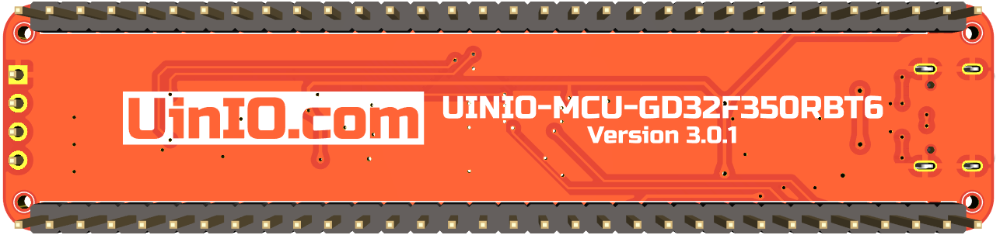

# UINIO-MCU-GD32F350RBT6 开发板

这是一款基于 LQFP64 封装的 [**兆易创新**](https://www.gigadevice.com.cn/) **GD32F350RBT6** 微控制器的评估板电路设计，该微控制器基于 **ARM Cortex-M4** 内核，主频达到了 `108MHz`，片上载有 `128K` 容量的 Flash 存储器，以及 `16K` 的 SRAM 存储器，并且各拥有两组 `USART`、`I2C`、`SPI`，以及一组 `I2S`、`12 位 ADC`、`12 位 DAC`，同时支持 **USB 2.0 FS OTG**。

## 评估板简介
