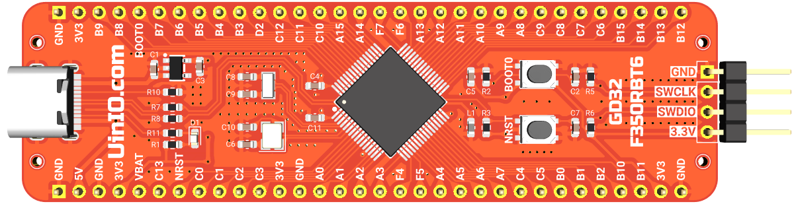
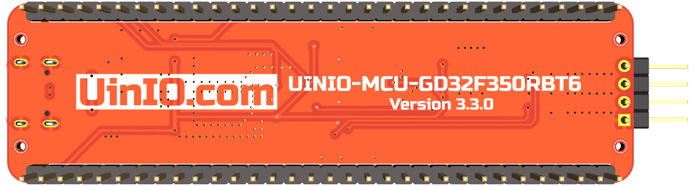

# UINIO-MCU-GD32F350RBT6 核心板

[**UINIO-MCU-GD32F350RBT6**](https://gitee.com/uinika/UINIO-MCU-GD32F350RBT6) 是一款基于 [**兆易创新**](https://www.gigadevice.com.cn/) 国产 **LQFP64** 封装的 **GD32F350RBT6** 微控制器的核心板电路设计，该微控制器基于 **ARM Cortex-M4** 内核架构，主频高达 `108MHz`，片上载有 `128K` 容量的 Flash 存储器，以及 `16K` 的 SRAM 存储器，并且拥有 2 组 `USART`、`I2C`、`SPI`，以及 1 组 `I2S`、`12 位 ADC`、`12 位 DAC`，同时支持 **USB 2.0 FS OTG** 协议，总体上属于 GPIO 引脚数量较多，但是外设资源有所取舍的主控芯片产品。

## 开发板简介

1. 引出了 **GD32F350RBT6** 微控制器上面的全部 GPIO 引脚资源；
2. `VSSA` 模拟地引脚使用了 `1KΩ 100Mhz` 的**磁珠**进行单点接地；
3. 单独提供有 4 线制 **SWD** 下载接口，便于快速与 [UINIO-DAP-Link](http://uinio.com/Project/UINIO-DAP-Link) 建立连接；
4. 使用 `8MHz` 与 `32.768KHz` 两枚贴片晶振，并且分别进行了简单的**包地**处理；
5. 主控芯片的 **USB 2.0 FS OTG** 被连接至 USB Type-C 接口，并且加入 `1.5 KΩ` 上拉电阻兼容 **USB-PD** 快充协议；

## 参考技术文档

[UinIO.com 电子技术实验室](http://uinio.com/) 为 UINIO-MCU-GD32F103CBT6 开源项目提供了如下一系列技术参考资料：

1. [《兆易创新 UINIO-MCU-GD32 标准库开发指南》](http://uinio.com/Project/UINIO-MCU-GD32/)
2. [《ARM 调试工具 UINIO-DAP-Link 应用详解》](http://uinio.com/Project/UINIO-DAP-Link/)
3. [《BOM 交互式物料清单与 PCB 布线在线预览》](http://uinio.com/archives/BOM/UINIO-MCU-GD32F350RBT6.html)
